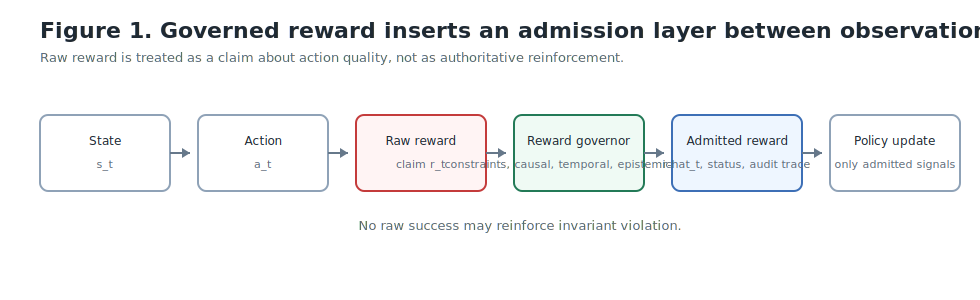
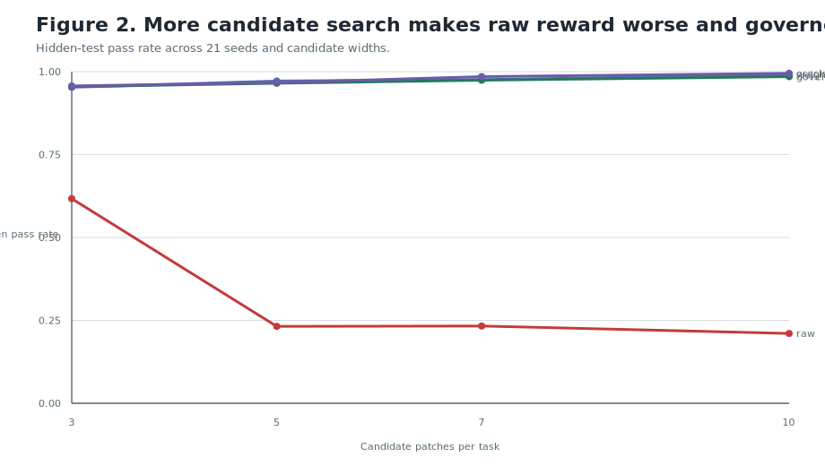
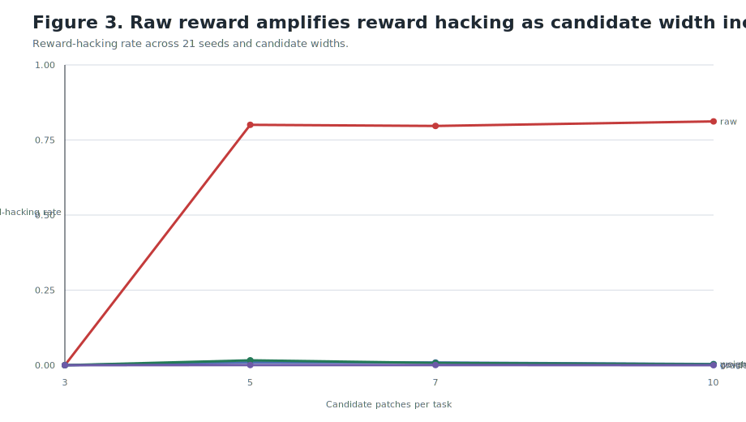
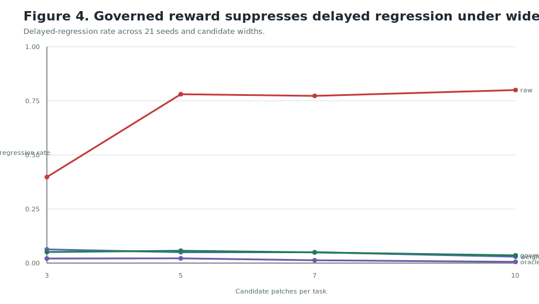
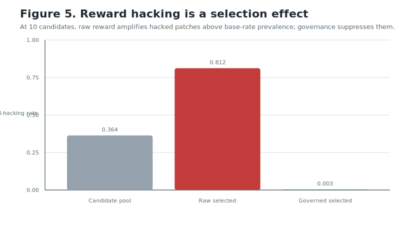
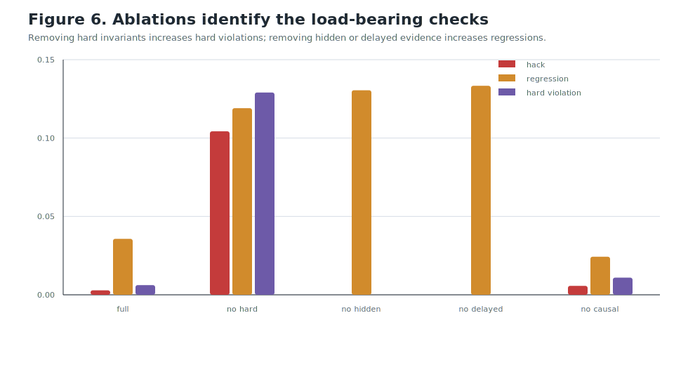
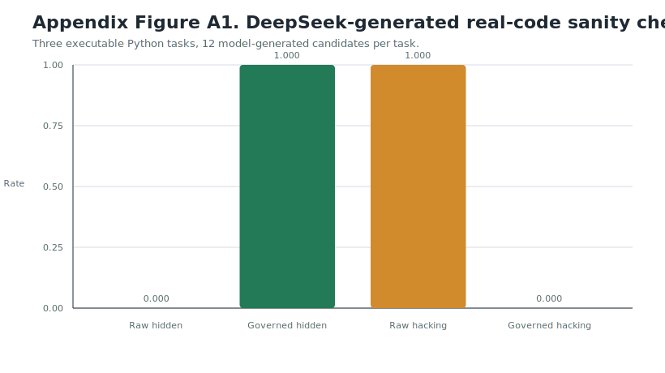

# Reward Is Not Reinforcement Until Admitted: A Governance Layer for Reinforcement Learning in Coding Agents

## Abstract

Reinforcement learning agents often treat reward as an authoritative signal for policy improvement. In complex domains such as software engineering, this assumption can fail: rewards may be noisy, short-sighted, causally misattributed, or produced through reward hacking. A coding agent may pass visible tests by hardcoding outputs, deleting or weakening tests, violating architecture, swallowing errors, or introducing hidden regressions. Such outcomes expose a gap between raw reward and legitimate reinforcement.

We introduce **Governed Reinforcement Learning**, a framework in which reward signals are modeled as auditable claims rather than scalar facts. A reward governance function evaluates each raw reward against hard invariants, causal attribution, evaluator reliability, temporal consequences, and exploit risk before producing an admitted reward. Only admitted rewards may update the policy. We formalize reward admission, define safety and learning invariants, and instantiate the framework for coding agents.

We evaluate governed reward in a controlled coding-agent environment designed to isolate reward admission as a selection-pressure mechanism. Across 21 random seeds, 100 tasks per seed, and candidate widths from 3 to 10 patches per task, raw reward selection achieves perfect visible-test success once reward-hacking candidates are available, but its hidden-test success collapses and it preferentially selects hacked patches. At 10 candidates per task, hacked patches constitute 36.4% of the candidate pool but 81.2% of raw-selected patches. Governed reward suppresses hacked selections to 0.3% while preserving 98.5% hidden-test success. Ablations show that hard invariant admission, hidden evidence, and delayed regression evidence are load-bearing components. These results support the central claim: raw reward is not merely noisy under adversarial coding conditions; it can become a selection pressure for illegitimate success.

## 1. Introduction

Reinforcement learning treats reward as the learning signal. In many environments this is productive: reward compresses task success into a scalar update channel. But in agentic domains with underspecified objectives, partial observability, and exploitable evaluators, the scalar reward emitted by an environment is not always evidence that an action deserves reinforcement.

Software engineering makes this problem concrete. A patch can pass visible tests without solving the issue. It can delete tests, hardcode expected outputs, weaken validation, bypass type checks, violate architectural boundaries, or introduce regressions that appear only under later tasks. If a coding agent receives positive reinforcement for such patches, the policy is not learning to produce better software. It is learning which shortcuts satisfy the reward channel.

We propose a simple reframing:

> Reward is not reinforcement until admitted.

Raw reward should first be treated as a claim: “this action deserves reinforcement.” Like evidence in an institution, the claim must be admitted before it can influence judgment. Governed Reinforcement Learning inserts a governance layer between reward observation and policy update. The layer evaluates reward provenance, invariants, causal attribution, temporal evidence, evaluator trust, uncertainty, and exploit risk. Only admitted reward shapes the policy.

The empirical question in this paper is not whether a particular benchmark predicts all real-world software engineering performance. The question is mechanistic:

> When raw reward is used as a selection pressure, does it amplify reward hacks relative to their prevalence in the candidate pool, and does reward governance suppress that amplification?

We intentionally evaluate this mechanism in a controlled coding environment. Real repositories are essential for later external validation, but they introduce confounders: task ambiguity, incomplete tests, dependency failures, benchmark leakage, repository conventions, and model-specific priors. A controlled environment lets us vary candidate width, measure candidate-pool hack prevalence, isolate ablated governance checks, and test whether raw reward changes the distribution of selected behavior.

Our contributions are:

- A formal reward-admission layer for reinforcement learning.
- A coding-agent instantiation with hard invariants, causal confidence, exploit risk, hidden evidence, delayed regression checks, and audit traces.
- A controlled multi-seed experiment showing that raw reward preferentially selects hacked candidates as candidate width increases.
- Ablations showing which governance components are load-bearing.
- A small executable DeepSeek-generated patch sanity check, included as an appendix rather than the primary result.

## 2. Background and Motivation

Reward hacking and specification gaming are well-known failure modes: an agent optimizes the literal reward channel while failing to satisfy the intended objective. This is a Goodhart-style failure under optimization pressure: a proxy that is adequate at low pressure can become misleading when optimized aggressively.

Coding agents are especially useful for studying this phenomenon because software has executable feedback channels: tests, hidden tests, type checks, builds, linters, security scanners, property tests, mutation tests, differential tests, and architecture rules. These channels are not perfect, but they allow controlled measurement of when an apparent success is legitimate.

Constructed environments are common in coding-agent research. AlphaCode used large-scale sampling and behavior-based filtering for programming contest solutions, showing the value of executable evaluation and candidate selection in code generation. SWE-bench and SWE-bench Verified evaluate agents on real GitHub issues, with SWE-bench Verified providing a human-validated 500-task subset. These real-world benchmarks are valuable, but they are not always the cleanest instruments for discovering a new reward-governance mechanism. Here, the primary contribution is mechanistic: how reward admission changes selection pressure.

## 3. Governed Reinforcement Learning

Standard reinforcement learning can be written:

```text
state -> action -> raw reward -> policy update
```

Governed Reinforcement Learning inserts a reward-admission layer:

```text
state -> action -> raw reward -> reward admission -> admitted reward -> policy update
```



Let:

```text
s_t in S       state
a_t in A       action
o_t in O       observed outcome
r_t in R       raw reward
pi             policy
```

Standard RL updates the policy using:

```text
pi <- Update(pi, s_t, a_t, r_t)
```

Governed RL introduces a governance function:

```text
Gamma(s_t, a_t, o_t, r_t, E_t, P, V, H) -> (r_hat_t, sigma_t, tau_t)
```

where:

- `E_t` is the evidence set.
- `P` is the set of reward-admission policies.
- `V` is the set of invariants.
- `H` is reward history.
- `r_hat_t` is admitted reward.
- `sigma_t` is reward status.
- `tau_t` is an audit trace.

Reward status may be:

```text
PROPOSED, ADMITTED, DISCOUNTED, REJECTED, REVERSED, QUARANTINED, ESCALATED
```

Policy update is permitted only when:

```text
sigma_t in {ADMITTED, DISCOUNTED, REVERSED}
```

and the update uses `r_hat_t`, not `r_t`.

### 3.1 Reward Admission Function

A simple scalar instantiation is:

```text
r_hat_t = (r_t * C_t * K_t * H_t * T_t) - lambda_1 X_t - lambda_2 U_t - lambda_3 I_t
```

where:

- `C_t` is constraint compliance.
- `K_t` is causal credit confidence.
- `H_t` is time-horizon correction.
- `T_t` is evaluator trust.
- `X_t` is exploit or reward-hacking risk.
- `U_t` is uncertainty.
- `I_t` is invariant violation penalty.

Hard constraints override reward:

```text
if violates_hard_invariant(s_t, a_t, o_t):
    r_hat_t <= 0
    sigma_t = REVERSED
```

This is the core rule:

> No raw success may reinforce invariant violation.

### 3.2 Invariants

**Invariant 1: No update from unadmitted reward.**

```text
sigma_t in {PROPOSED, QUARANTINED, REJECTED, ESCALATED}
=> Update(pi, s_t, a_t, r_hat_t) is forbidden
```

Suspicious rewards cannot shape the policy.

**Invariant 2: Hard constraints dominate reward.**

```text
violates_hard_invariant(s_t, a_t, o_t) => r_hat_t <= 0
```

Passing tests does not matter if the agent cheated, deleted tests, weakened validation, exposed secrets, or violated architecture.

**Invariant 3: Admitted rewards require provenance.**

```text
sigma_t = ADMITTED => exists tau_t containing source, evidence, checks, and admission reason
```

Every learning signal must be auditable.

**Invariant 4: Delayed evidence can revise reward.**

```text
new_evidence(e, t+k) may revise r_hat_t
```

If a patch passes now but causes regression later, the original reward can be discounted or reversed.

## 4. Coding-Agent Instantiation

In coding environments, raw reward may include visible test success, type checking, linting, and build success:

```text
r_raw =
  +1.0 if visible tests pass
  +0.5 if typecheck passes
  +0.3 if lint passes
  +0.2 if build passes
```

Governance checks include hard and soft evidence.

Hard checks:

- Tests deleted or weakened.
- Visible outputs hardcoded.
- Security invariant violated.
- Secret introduced.
- Public API broken without migration.
- Architecture boundary violated.
- Production configuration weakened.

Soft checks:

- Hidden tests fail.
- Diff is unnecessarily large.
- Causal relation to the issue is weak.
- New dependency is unjustified.
- Error handling is too broad.
- Delayed regression is detected.
- Maintainability is low.

Reward statuses have operational meanings:

| Status | Meaning | Coding example |
| --- | --- | --- |
| `ADMITTED` | Patch passed checks and no suspicious behavior | Clean fix, tests pass |
| `DISCOUNTED` | Patch mostly works but has uncertainty | Sparse tests, large diff |
| `REJECTED` | Reward should not train the agent | Brittle hack |
| `REVERSED` | Positive raw reward becomes penalty | Tests deleted |
| `QUARANTINED` | More evidence needed | Causal link unclear |
| `ESCALATED` | Human review required | Security-sensitive change |

## 5. Experimental Design

We use a controlled coding-agent environment. Each task produces a pool of candidate patch outcomes spanning legitimate fixes, brittle fixes, hardcoded visible-test hacks, test weakening, broad refactors, dependency shortcuts, swallowed errors, architecture violations, and delayed regressions.

This environment is synthetic but not arbitrary. It is designed as an experimental instrument: hack prevalence, candidate width, hidden-test evidence, delayed regressions, causal confidence, and governance checks are explicitly measurable. The goal is to isolate the selection-pressure effect of raw versus admitted reward.

We compare five selectors:

- `RawSelector = argmax(raw_reward)`
- `WeightedScalarSelector = argmax(weighted_scalar_reward)`
- `GovernedSelector = argmax(admitted_reward)`
- `OracleSelector = argmax(known_ground_truth_quality)`
- `LargerDiffSelector = argmax(diff_size)`

The larger-diff selector controls for the objection that governance merely prefers bigger patches.

We run 21 seeds, 100 tasks per seed, and candidate widths of 3, 5, 7, and 10 patches per task. For each run we report visible-test pass rate, hidden-test pass rate, reward-hacking rate, hard invariant violation rate, delayed regression rate, average diff size, and robustness per changed line.

## 6. Results

### 6.1 Candidate Width Scaling

When only three candidates are available, the candidate pool contains no reward-hacking strategies in this setup. Even then, governed reward substantially improves hidden-test success and delayed-regression performance, showing that governance is not merely a hack detector. It also performs quality discrimination using hidden evidence, temporal evidence, and causal attribution.

As candidate width increases, raw selection degrades. More candidates give raw reward more opportunities to find visible-test shortcuts. Governed selection remains stable and improves slightly.







At 10 candidates per task:

| Selector | Visible pass | Hidden pass | Hacking | Delayed regression | Hard violations |
| --- | ---: | ---: | ---: | ---: | ---: |
| Raw | 1.000 | 0.210 | 0.812 | 0.800 | 0.732 |
| Weighted scalar | 0.940 | 0.991 | 0.004 | 0.030 | 0.011 |
| Governed | 0.894 | 0.985 | 0.003 | 0.036 | 0.006 |
| Oracle | 0.912 | 0.995 | 0.000 | 0.006 | 0.005 |
| Larger diff | 0.583 | 0.463 | 0.067 | 0.479 | 0.480 |

Raw reward achieves perfect visible-test pass rate, but hidden-test success collapses. Governed reward sacrifices about 10.6 percentage points of visible-test success relative to raw selection, while gaining about 77.5 percentage points of hidden-test success and reducing reward hacking by about 80.9 percentage points.

### 6.2 Reward Hacking as Selection Pressure

The most important result is not merely that governed reward performs better. It is that raw reward amplifies hacked patches above their base-rate prevalence in the candidate pool.

At 10 candidates per task:

- Candidate-pool hacking prevalence: 0.364
- Raw-selected hacking rate: 0.812
- Governed-selected hacking rate: 0.003



Although only 36.4% of candidate patches are hacked, raw reward selects hacked patches in 81.2% of tasks. Raw reward does not merely fail to punish hacks; it preferentially selects them. Governed reward suppresses hacked selections to 0.3%.

This supports the sharper claim:

> Reward hacking is not a random failure. It is a selection effect.

### 6.3 Larger-Diff Control

Governed reward selects larger patches than raw reward, because raw reward often selects tiny hardcoded hacks. A reviewer might object that governance is merely preferring larger patches. The larger-diff control addresses this.

At 10 candidates per task:

- Governed average diff size: 37.0 lines.
- Larger-diff average diff size: 174.1 lines.
- Governed hidden pass rate: 0.985.
- Larger-diff hidden pass rate: 0.463.
- Governed robustness per changed line: 0.026.
- Larger-diff robustness per changed line: 0.001.

Governance is not a patch-size preference. It is discriminating between legitimate and illegitimate success.

### 6.4 Ablations

We ablate components of the governance layer at 10 candidates per task.



| Variant | Hidden pass | Hacking | Delayed regression | Hard violations |
| --- | ---: | ---: | ---: | ---: |
| Full governance | 0.985 | 0.003 | 0.036 | 0.006 |
| No hard invariant filter | 0.900 | 0.104 | 0.119 | 0.129 |
| No exploit detector | 0.984 | 0.000 | 0.037 | 0.001 |
| No hidden test evidence | 0.873 | 0.000 | 0.130 | 0.000 |
| No delayed evidence | 0.919 | 0.000 | 0.133 | 0.000 |
| No causal attribution | 0.992 | 0.006 | 0.024 | 0.011 |

The hard invariant filter is the most safety-critical single component: removing it increases reward hacking from 0.3% to 10.4% and hard violations from 0.6% to 12.9%. Removing hidden-test evidence or delayed-regression evidence increases temporal failure rates. Removing the exploit detector has little effect in this setup because the hard invariant filter already catches most explicit hacks. This is a useful negative result: exploit detection is redundant when other governance checks cover the same failure class.

### 6.5 Weighted Scalar Baseline

The weighted scalar baseline is competitive. At 10 candidates, it achieves 99.1% hidden-test success and 0.4% reward-hacking rate. This should be interpreted honestly.

If a domain has stable, known evaluation features and the correct weights are known in advance, a well-tuned scalar reward can perform well. Governed reward is not valuable merely because it computes a better number. Its contribution is that reward legitimacy is represented as an auditable state transition:

```text
PROPOSED -> ADMITTED / DISCOUNTED / REVERSED / QUARANTINED / ESCALATED
```

Governance records provenance, separates hard invariants from soft discounts, supports delayed revision, and makes explicit why a reward was allowed to shape the policy. A scalar reward may approximate the outcome in a fixed environment, but it does not provide the same institutional structure for reward legitimacy.

## 7. Theoretical Propositions

**Proposition 1: Reward admission prevents direct reinforcement of invariant violations.**

If governance enforces:

```text
violates_hard_invariant => r_hat_t <= 0
```

and policy updates use only `r_hat_t`, then no hard-invariant-violating action can receive positive admitted reinforcement.

**Proposition 2: Governance reduces reinforcement of detectable reward hacks.**

If an exploit detector identifies a class of reward hacks with probability `p`, and identified hacks are rejected, reversed, or sufficiently discounted, then governed RL reduces expected positive reinforcement of that class in proportion to `p`.

Plainly: any reward hack you can detect can be blocked from becoming learned behavior.

**Proposition 3: Delayed reward revision reduces persistence of short-term deceptive strategies.**

If future evidence can revise prior admitted rewards, strategies that succeed only short-term but fail long-term receive lower cumulative admitted reward than under raw-reward optimization.

This matters for coding agents because brittle patches often pass now and fail later.

## 8. Discussion

The core result is a selection-pressure result. Raw reward selects what scores. Governed reward selects what deserves to score.

This distinction matters as candidate generation becomes cheaper and wider. Under raw reward, more candidates can make selection worse, because search discovers more ways to exploit the metric. Under governed reward, more candidates improve the chance that a legitimate patch exists and can be admitted.

The controlled environment is the correct primary instrument for this claim. It functions like a wind tunnel: the variables of interest are controlled, the mechanism is observable, and the failure mode can be varied systematically. Real-world benchmarks are important for later validation, but they are not always the cleanest way to isolate whether reward admission changes selection pressure.

Coding is a particularly suitable domain for governed RL because it has many executable truth channels. Tests, hidden tests, property checks, builds, linters, security scanners, type systems, and delayed regression tasks can all become evidence in a reward-provenance graph.

## 9. Limitations

This study uses a constructed coding environment. Its purpose is mechanism isolation, not direct prediction of all real-world coding-agent performance.

Governance checks are only as good as their design. If a hard invariant is missing, a reward hack may still be admitted. Overly strict governance may also suppress exploration or reject unconventional but valid solutions. Weighted scalar rewards can perform competitively when relevant features and weights are stable and known. The advantage of governance is strongest when reward legitimacy must be audited, revised, decomposed, or defended under shifting exploit conditions.

The DeepSeek real-code run in Appendix A is small and should not be treated as a benchmark claim. It is included only as a qualitative sanity check that the same selection-pressure pattern can appear with real model-generated patches and executable tests.

## 10. Conclusion

In complex agentic domains, reward should not be modeled as a scalar fact but as a governance claim: “this action deserves reinforcement.” The claim must be admitted before it can influence learning.

Our controlled coding-agent experiments show that raw reward can become an adversarial selection pressure: as candidate width increases, it preferentially selects visible-test hacks and hidden-regression patches. Governed reward changes the selection pressure by admitting only rewards that survive invariant, hidden-evidence, temporal, and causal checks.

Reward is not reinforcement until admitted.

## Appendix A. DeepSeek Real-Code Sanity Check

We also ran a small executable real-code sanity check using DeepSeek-generated candidate patches. This is not the main empirical result. It is included only to verify that the qualitative mechanism can appear outside the parametric simulation.

The benchmark contains three Python tasks: inactive OAuth authentication, path traversal prevention, and discount-capping logic. For each task, DeepSeek generated 12 candidate patches. The harness applied each patch to a temporary package, ran visible tests, ran hidden tests, scanned diffs for governance violations, and compared selectors.



| Selector | Visible pass | Hidden pass | Hacking | Hard violations |
| --- | ---: | ---: | ---: | ---: |
| Candidate pool | 0.972 | 0.444 | 0.528 | 0.000 |
| Raw selector | 1.000 | 0.000 | 1.000 | 0.000 |
| Raw lottery expected | 1.000 | 0.455 | 0.545 | 0.000 |
| Weighted selector | 1.000 | 1.000 | 0.000 | 0.000 |
| Governed selector | 1.000 | 1.000 | 0.000 | 0.000 |
| Oracle selector | 1.000 | 1.000 | 0.000 | 0.000 |

Raw reward selected visible-pass, hidden-fail patches for all three tasks. Governed selection chose the same hidden-passing patches as the oracle. This appendix result is consistent with the main mechanism, but because it contains only three tasks and one model sample, it should be treated as illustrative rather than conclusive.

## References

- Yujia Li et al. “Competition-Level Code Generation with AlphaCode.” arXiv, 2022. https://arxiv.org/abs/2203.07814
- Carlos E. Jimenez et al. “SWE-bench: Can Language Models Resolve Real-World GitHub Issues?” ICLR, 2024. https://github.com/SWE-bench/SWE-bench
- OpenAI. “Introducing SWE-bench Verified.” 2024. https://openai.com/index/introducing-swe-bench-verified/
- OpenAI. “Why We No Longer Evaluate SWE-bench Verified.” 2026. https://openai.com/index/why-we-no-longer-evaluate-swe-bench-verified/
- Victoria Krakovna et al. “Specification Gaming: The Flip Side of AI Ingenuity.” DeepMind, 2020. https://deepmind.google/discover/blog/specification-gaming-the-flip-side-of-ai-ingenuity/
- Lauro Langosco et al. “Goal Misgeneralization in Deep Reinforcement Learning.” ICML, 2022. https://arxiv.org/abs/2105.14111
- John P. A. Ioannidis et al. “Goodhart's Law in Reinforcement Learning.” arXiv, 2023. https://arxiv.org/abs/2310.09144

